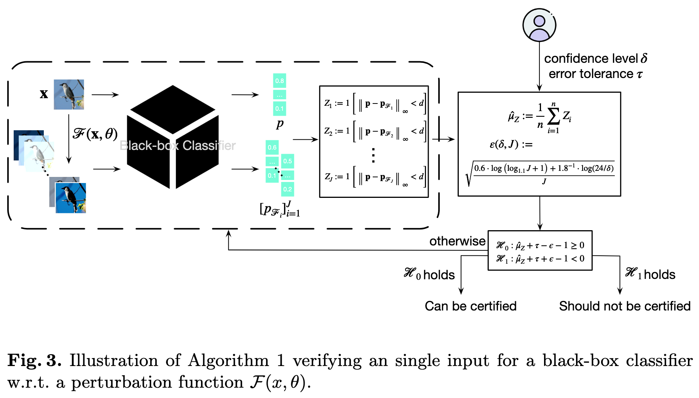
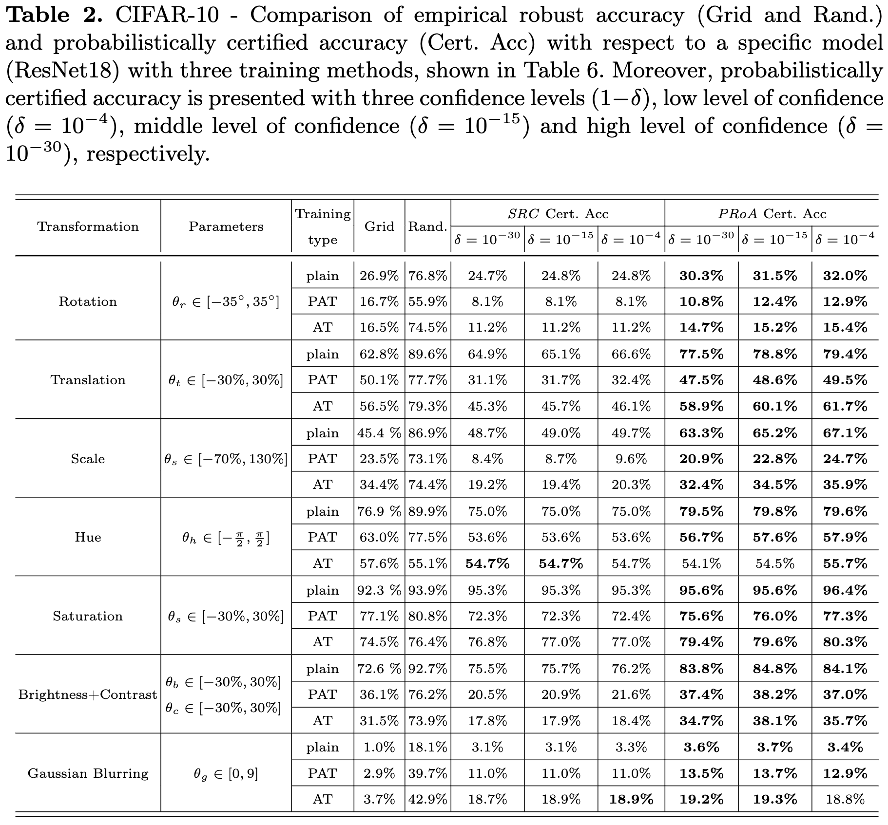
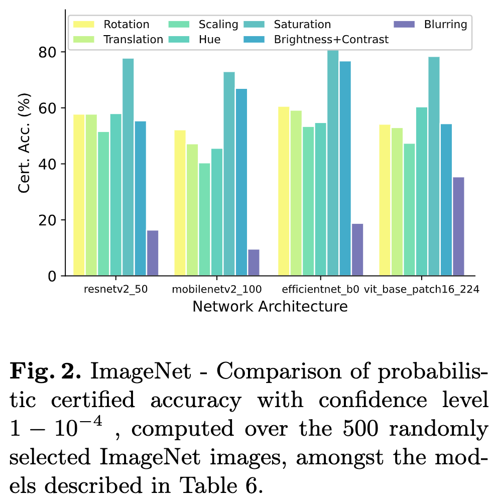
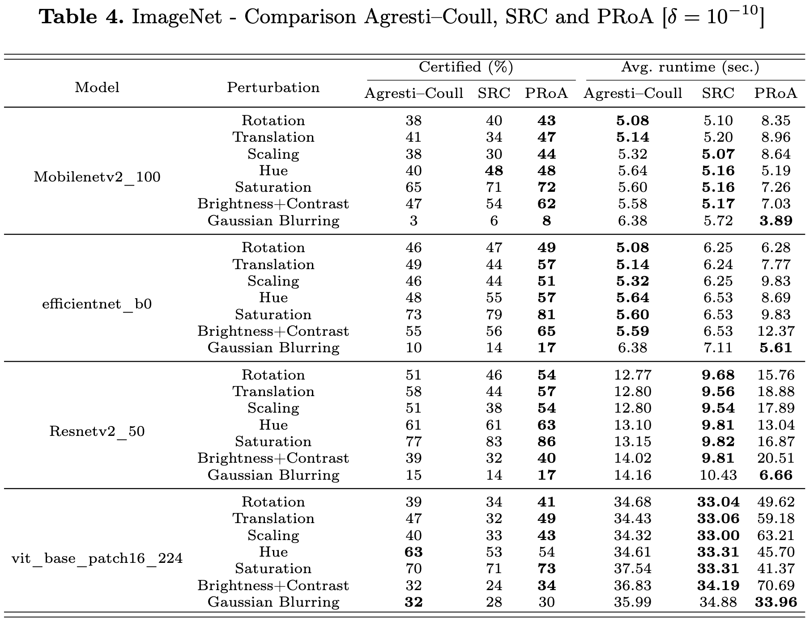

# PRoA: A Probabilistic Robustness Assessment against Functional Perturbations

__Tianle Zhang, Wenjie Ruan, and Jonathan E. Fieldsend__

The accompanying paper _PRoA: A Probabilistic Robustness Assessment against Functional Perturbations_ is accepted by  [European Conference on Machine Learning and Principles and Practice of Knowledge Discovery in Databases (*ECML-PKDD*)](https://ecmlpkdd.org/).

#### Citation

```
@article{2022arXiv220702036Z,
       author = {{Zhang}, Tianle and {Ruan}, Wenjie and {Fieldsend}, Jonathan E.},
        title = "{PRoA: A Probabilistic Robustness Assessment against Functional Perturbations}",
      journal = {arXiv e-prints},
         year = 2022,
        month = jul,
archivePrefix = {arXiv},
       eprint = {2207.02036},
 primaryClass = {cs.LG},
       adsurl = {https://ui.adsabs.harvard.edu/abs/2022arXiv220702036Z},
}


```


# Abstract

In safety-critical deep learning applications, robustness measurement is a vital pre-deployment phase. However, existing robustness verification methods are not sufficiently practical for deploying machine learning systems in the real world. On the one hand, these methods attempt to claim that no perturbations can "fool" deep neural networks (DNNs), which may be too stringent in practice. On the other hand, existing works rigorously consider L_p bounded additive perturbations on the pixel space, although perturbations, such as colour shifting and geometric transformations, are more practically and frequently occurring in the real world. Thus, from the practical standpoint, we present a novel and general {\it probabilistic robustness assessment method} (PRoA) based on the adaptive concentration, and it can measure the robustness of deep learning models against functional perturbations. PRoA can provide statistical guarantees on the probabilistic robustness of a model, {\it i.e.}, the probability of failure encountered by the trained model after deployment. Our experiments demonstrate the effectiveness and flexibility of PRoA in terms of evaluating the probabilistic robustness against a broad range of functional perturbations, and PRoA can scale well to various large-scale deep neural networks compared to existing state-of-the-art baselines. For the purpose of reproducibility, we release our tool on GitHub: {\em https://github.com/TrustAI/PRoA}.

# Schematic Overview


# 


# Sample Results 






# 


# Developer's Platform

```
cox==0.1.post3
dill==0.3.4
GitPython==3.1.27
kornia==0.6.3
matplotlib==3.4.3
numpy==1.21.2
openpyxl==3.0.9
pandas==1.2.5
Pillow==9.1.1
scikit_learn==1.1.1
scipy==1.7.1
seaborn==0.11.2
statsmodels==0.11.1
timm==0.5.0
torch==1.9.1+cu111
torchvision==0.10.1+cu111
tqdm==4.64.0
```


# Run

```python
python -m eval_cifar.py
```

or

```python
python -m eval_imagenet.py
```


# Remark

This tool is under active development and maintenance, please feel free to contact us about any problem encountered.

Best regards,

Tianle Zhang

[tz294@exeter.ac.uk](mailto:tz294@exeter.ac.uk)
